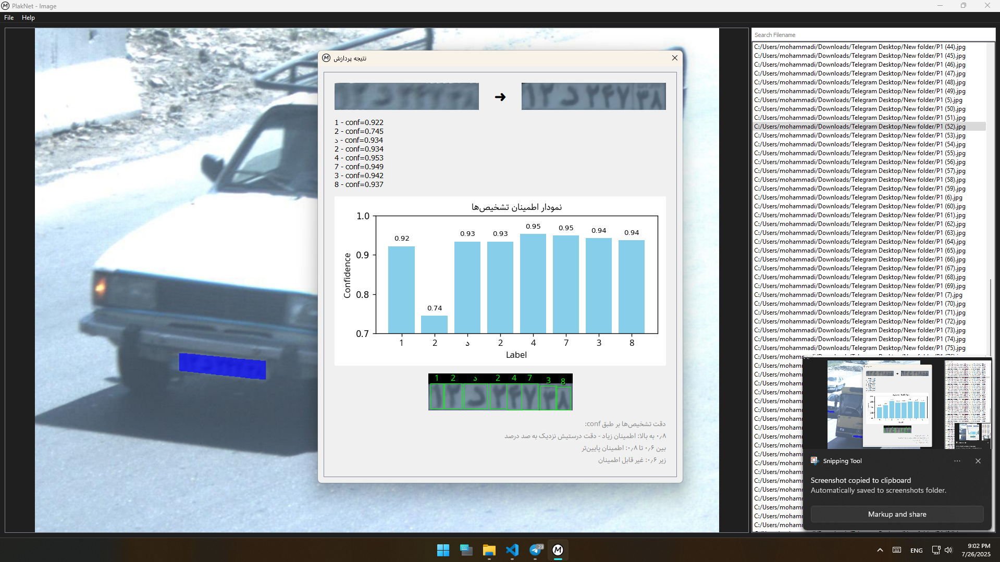

# Robust License Plate OCR System with YOLO & Restormer

**This system works even on blurry, angled license plates.**

The pipeline follows a multi-stage architecture:

1. **YOLOv11** for license plate detection and segmentation  
2. A robust module for precise cropping and automatic **perspective correction**  
3. **Restormer** for enhancing plate image quality (deblurring, denoising, low-light correction)  
4. Custom **OCR module** for accurate character recognition under real-world conditions

Unlike most OCR systems that perform recognition directly on raw images, this system first **enhances** the plate quality — resulting in significantly higher accuracy, even with blurry, angled, or low-light images.

A few examples of the model's performance on Iranian license plates:

---

### 🔧 Technologies Used
- YOLOv11  
- Restormer  
- PyTorch  
- OpenCV  
- OCR  
- Python  

### 📌 Use Cases
- Traffic surveillance  
- Smart parking  
- Police enforcement  
- Urban monitoring  
